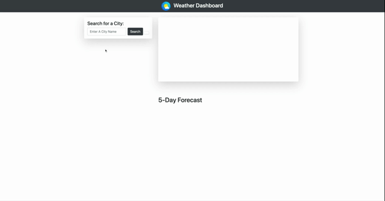

Weather Dashboard with OpenWeather API

This is a mini project focusing on retrieving data from third-party API and using it in the context of their own. By using OpenWeather API, this weather dashboard that will retrieve weather data for cities that you search, and run in your browser and feature dynamically updated HTML and CSS.

## User Story

```
AS A traveler
I WANT to see the weather outlook for multiple cities
SO THAT I can plan a trip accordingly
```

## Key Features

```
- Form inputs to search for cities
- Current and future conditions for city selected
- Search history
- City name, date, weather conditions icon, temperature, humidity, wind speed, UV index
- UV index with color that indicates different conditions
- 5-day forecast

```

The following image demonstrates the application functionality:


